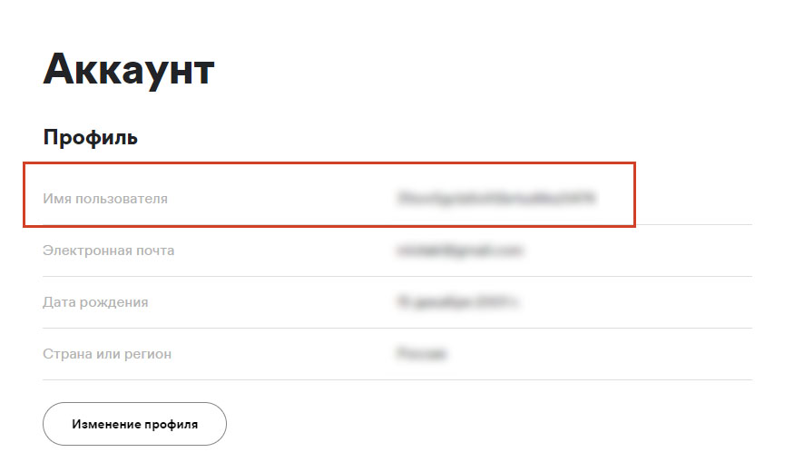
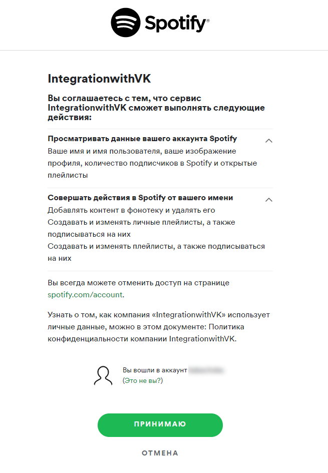

# VKAudioParserToSpotify
# About
Приложение получает список треков со страницы VK, обрабатывает его, затем по названию получает ID треков в Spotify, затем добавляет их в библиотеку пользователя.
## How to run
В репозитории в папке **release** лежит билд, который Вы можете запустить на своем компьютере без установки python и его модулей. Скачайте эту папку себе на компьютер.
### Customizing config.json
1. Необходимо настроить `config.json`. Укажите `vklogin` и `vkpassword` для авторизации. Вы можете использовать любой аккаунт VK для получения библиотеки треков. Однако если вы используете отличную страницу от страницы, с которой необходимо получить треки, то проверьте, что у этой страницы VK открыты аудиозаписи. Заполните поле `ownerid`. Его можно получить в url, нажав на аудиозаписи пользователя. Пример: `vk.com/audios674299252` `674299252` - ownerid.
2. Авторизуйтесь в Spotify. В поле `spotifyid` вбейте имя пользователя вашего аккаунта spotify. Найти его можно по [ссылке](https://www.spotify.com/kg-ru/account/overview/). 
3. В поле `DefaultPlaylistName` вбейте название базового плейлиста, в который будут добавляться треки, для которых не будут создаваться отдельные плейлисты.
4. В поле `ValueAtWhichThePlaylistIsCreated` вбейте минимальное количество треков исполнителя, при котором для него будет создаваться плейлист.

Ваш config.cfg должен выглядеть примерно так:
```json
{
    "vklogin" : "+71234567890",
    "vkpassword" : "qwertyuiop1234",
    "vkownerid" : "478013383",
    "spotifyid" : "qwertyqwertyqwertyqwer1234",
    "DefaultPlaylistName" : "MyCollectionVK",
    "ValueAtWhichThePlaylistIsCreated" : 3
}
```
### Run
1. Запустите `startapp.exe`. Программа начнет выполняться.
2. В момент авторизации Spotify приложение откроет браузер и попросит разрешения на внесение изменений в Ваши плейлисты. Подтвердите их, нажав кнопку _**Принимаю**_. 



3. Spotify переадресует Вас на другую страницу, необходимо будет скопировать url адрес и вставить его в консоль. Ваш url должен выглядеть примерно так: `http://example.com/callback/#access_token=BQAX4aa3B8RvgJDVjoJl0ZvNQxLpCMJmPG-oNm8zB1Di0nJWIbvgezGewvNdihsN_Xz-qj8ymW8qAmNBLbCck5rPs9my0df-N9DQEPmpYwobmhUCtYn7l7DdbfNj_jGd9aAWV44D0bmIzkxZebzPElUitekpMfnHgm5Y43TUAyUUpNOG-DaSm_70dNkyYNXVdF0A10jAjHSM65zzSbWLH1cE0wApJ1J67Wf7zcs5w9aLyOQ&token_type=Bearer&expires_in=3600`
## Properties
- В VK у пользователя могут быть добавлены треки, которые уже _**удалены**_ с самой платформы, они добавляться не будут
- В Spotify присутствуют только _**официальные**_ композиции, поэтому часть треков будет пропущена. Глянуть список не найденных треков можно будет в файле `parsed/tracksNotFoundInSpotify.json`. Также само приложение в конце информирует о процентном соотношении перенесённых треков к общему количеству
- Получение аудиозаписей пользователя реализовано не через официальное апи, поэтому получение аудио происходит достаточно долго, так как создана задержка между запросами, чтобы IP адрес не забанило
